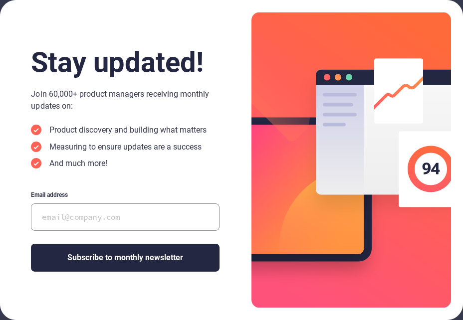

# Frontend Mentor - Newsletter sign-up form with success message solution

This is a solution to the [Newsletter sign-up form with success message challenge on Frontend Mentor](https://www.frontendmentor.io/challenges/newsletter-signup-form-with-success-message-3FC1AZbNrv). Frontend Mentor challenges help you improve your coding skills by building realistic projects.

## Table of contents

- [Overview](#overview)
  - [The challenge](#the-challenge)
  - [Screenshot](#screenshot)
  - [Links](#links)
- [Built with](#built-with)
- [Author](#author)

## Overview

### The challenge

Users should be able to:

- Add their email and submit the form
- See a success message with their email after successfully submitting the form
- See form validation messages if:
  - The field is left empty
  - The email address is not formatted correctly
- View the optimal layout for the interface depending on their device's screen size
- See hover and focus states for all interactive elements on the page

### Screenshot

### Links

- Solution URL: [https://github.com/mickael-o3o/newsletter-sign-up-form.git](https://github.com/mickael-o3o/newsletter-sign-up-form.git)
- Live Site URL: [https://mickael-o3o.github.io/newsletter-sign-up-form](https://mickael-o3o.github.io/newsletter-sign-up-form)

## Built with

- [Vue](https://vuejs.org)
- [Sass](https://sass-lang.com)
- CSS custom properties
- Flexbox
- CSS Grid

## Author

- Frontend Mentor - [@mickael-o3o](https://www.frontendmentor.io/profile/mickael-o3o)
